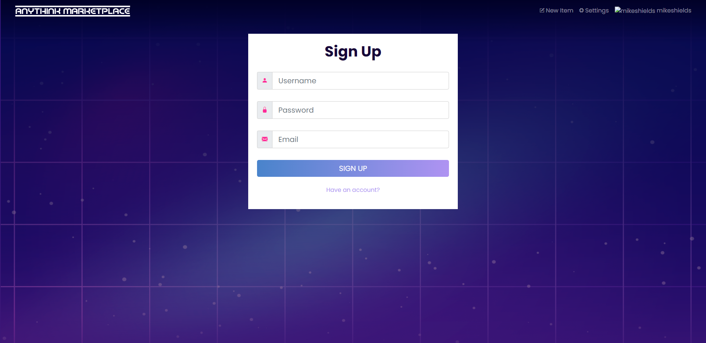

# Welcome to the Anythink Market repo

To start the app use Docker. It will start both frontend and backend, including all the relevant dependencies, and the db.

Please find more info about each part in the relevant Readme file ([frontend](frontend/readme.md) and [backend](backend/README.md)).

## Development

When implementing a new feature or fixing a bug, please create a new pull request against `main` from a feature/bug branch and add `@vanessa-cooper` as reviewer.

## First setup

### Install Docker
Go [here](https://docs.docker.com/get-docker/) for instructions.

- Verify Docker Installation

```bash
$ docker -v
Docker version xx.xx.xx, build xxxxxxx
```
- Verify Docker Compose Installation
```bash
$ docker-compose -v
docker-compose version x.xx.x, build xxxxxxx
```

## Load Backend & Frontend

- Run the following command from the root of this repo:
```bash
$ docker-compose up
```

- Verify that the frontend is running by visiting http://localhost:3000/api/ping

- Verify that the backend is running and is connected to the frontend by visiting http://localhost:3001/register

- If all is well you will see the sign up form below, create an account by signing up. 



